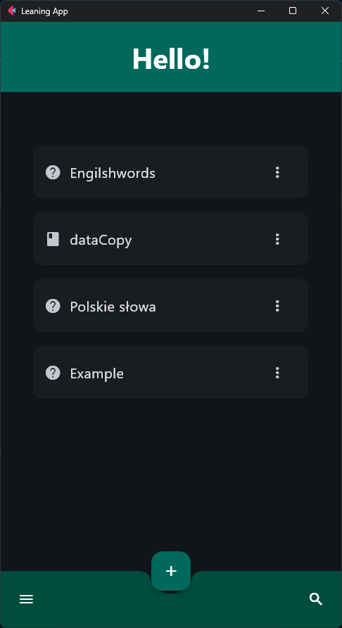
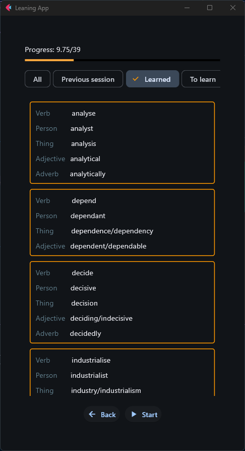
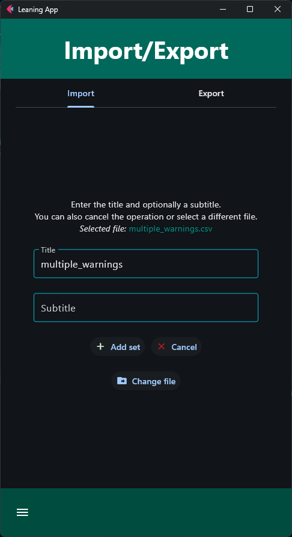
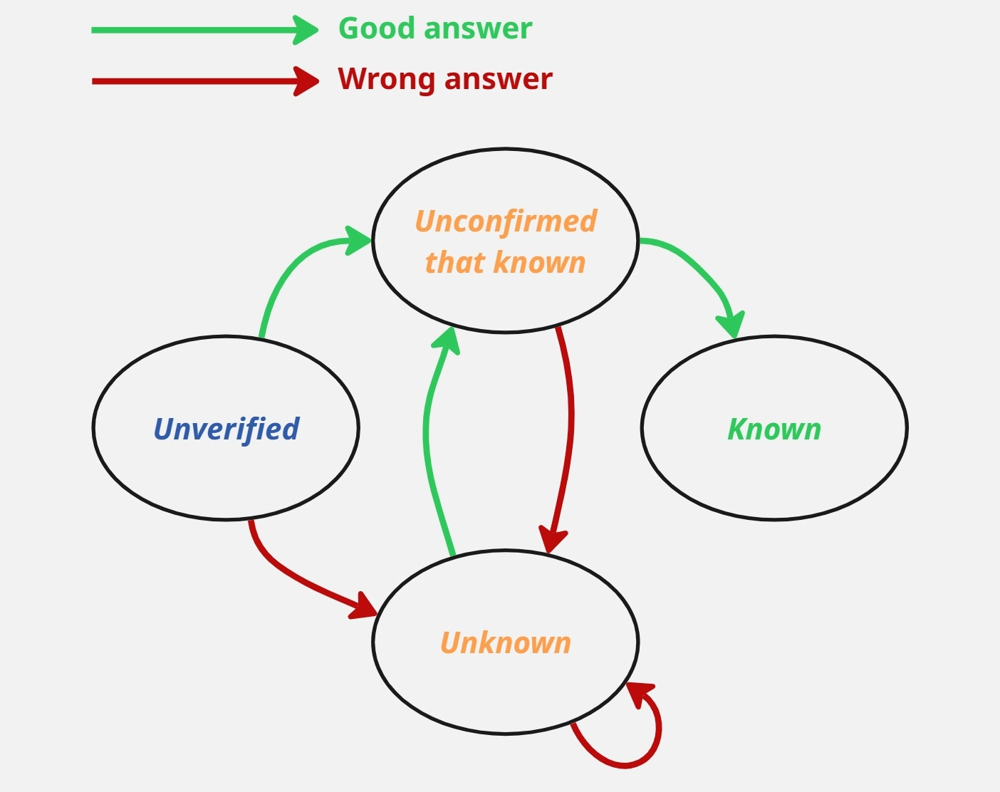

# 📚 Word Learning Application


> _Effective tool for learning words and definitions based on intelligent repetition algorithms._

## 🚀 How to Run the Application

This project uses [uv](https://docs.astral.sh/uv/) for dependency management. Python 3.12+ is required.

```bash
uv sync
uv run flet run .
```

## Project Structure

The thin launcher `src/main.py` calls `ft.run` on the `learning_app` package
(under `src/`, as expected by Flet packaging):

```text
src/
  main.py                 # thin launcher: ft.run(learning_app.app.main)
  assets/                 # app icons / splash / bundled demo CSVs for flet build
  learning_app/
    app.py                # Flet application entrypoint
    data/                 # CSV processing, data model, file paths, demo sets, constants
    ui/
      components/         # reusable Flet controls
      screens/            # larger application screens and menus
    utils/                # small general helpers
tests/                    # tests (not packaged into the app)
```

## 📱 Android Release

You can also download the Android version of the application:

[](https://github.com/BartoszKog/my-first-learning-app/releases/latest) 

## 📖 Documentation

Full developer documentation available on GitHub Pages:

[](https://bartoszkog.github.io/my-first-learning-app/)

## 📋 About the Application

This application was designed with effective vocabulary and definition learning in mind. It allows you to:

- ✅ Import your own study sets
- ✅ Add built-in demo sets from Settings
- ✅ Track your progress
- ✅ Intelligently schedule repetitions
- ✅ Export data and statistics

## 📱 Application Interface

<table>
    <tr>
        <td></td>
        <td></td>
    </tr>
    <tr>
        <td></td>
        <td></td>
    </tr>
</table>

## 🧠 Learning Algorithm

The application uses an advanced learning algorithm visualized in the graph below:



### Word Learning Queue

Words are queued for learning according to the following states:

| State                    | Code                | Description                                                       |
| ------------------------ | ------------------- | ----------------------------------------------------------------- |
| **Unknown**              | 0/0/1               | Words verified as unknown                                         |
| **Unverified**           | 0/0/0               | Words that have not yet been verified                             |
| **Unconfirmed as known** | 1/0/0, 1/0/1, 1/1/1 | Words marked as correctly answered but not yet confirmed as known |
| **Known**                | 1/1/0               | Words answered correctly twice in a row                           |

### Queuing Process

1. First, words in the **Unknown** state (0/0/1) are selected
2. If there aren't enough unknown words, **Unverified** words (0/0/0) are added
3. If more words are still needed, **Unconfirmed as known** words are added

### Explanation of State Codes (0/0/0)

State codes (e.g., 0/0/0) represent the following word attributes:

- First digit: whether the word was answered correctly in the last attempt (0 - no, 1 - yes)
- Second digit: whether the word was answered correctly in a row (0 - no, 1 - yes)
- Third digit: whether the word is marked as requiring learning (0 - no, 1 - yes)

## 📊 File Formats

The application supports two types of CSV files:

### 1. `_words.csv` Files

Contain words grouped by parts of speech:

- `verb`: verb
- `person`: person
- `thing`: noun
- `adjective`: adjective
- `adverb`: adverb

### 2. `_definitions.csv` Files

Contain definitions and their corresponding words:

- `definition`: definition
- `word`: corresponding word

### Statistics Columns (Optional)

- `correct_answers`: number of correct answers (integer)
- `good_answers_in_a_row`: whether there were correct answers in a row (boolean)
- `good_answer`: whether the last answer was correct (boolean)
- `word_to_learn`: whether the word requires learning (boolean)

### Sample CSV File

```csv
,definition,word
0,"1 number",one
1,"2 number",two
```

## 💡 Tips

- Make sure your CSV files have the correct format and columns
- Data import/export is available from the app's main menu
- From **Settings**, use **Add demo sets** to install three sample learning sets (word formation, English definitions, English–Polish). Delete them like any other set; Add again only installs missing ones
- Words marked as "learned" will appear less frequently
- The app automatically prioritizes words you find challenging
- For definitions with multiple correct answers or word forms, you can use the slash symbol (/) to separate them. For example: "go/goes/went". During a learning session, entering any one of these words will be marked as correct.

## 🔧 Technologies

The application was created using:

- **Flet** - a modern framework combining Flutter and Python
- **Python** - backend programming language
- **Pandas** - data manipulation library

---

*Created with ❤️ and Flet (Flutter + Python)*