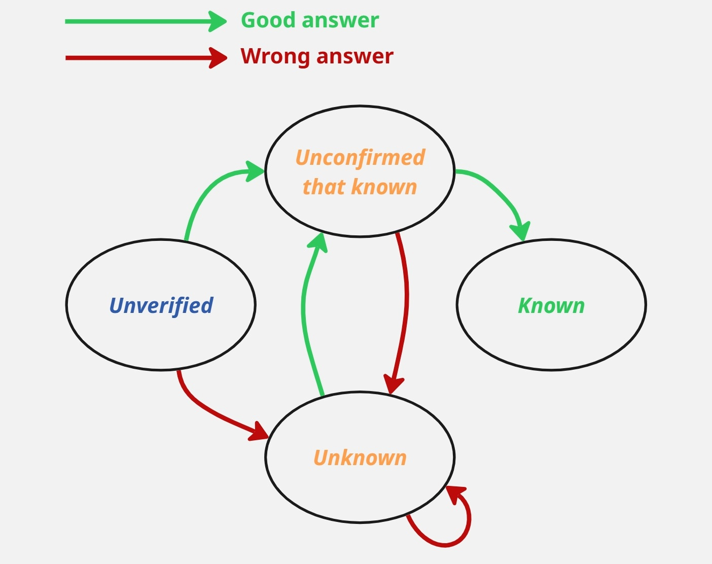

# 📚 Word Learning Application


> _Effective tool for learning words and definitions based on intelligent repetition algorithms._

## 🚀 How to Run the Application

```bash
flet run [app_directory]
```

## 📋 About the Application

This application was designed with effective vocabulary and definition learning in mind. It allows you to:

- ✅ Import your own study sets
- ✅ Track your progress
- ✅ Intelligently schedule repetitions
- ✅ Export data and statistics

## 🧠 Learning Algorithm

The application uses an advanced learning algorithm visualized in the graph below:



### Word Learning Queue

Words are queued for learning according to the following states:

| State | Code | Description |
|------|-----|------|
| **Unknown** | 0/0/1 | Words verified as unknown |
| **Unverified** | 0/0/0 | Words that have not yet been verified |
| **Unconfirmed as known** | 1/0/0, 1/0/1, 1/1/1 | Words marked as correctly answered but not yet confirmed as known |
| **Known** | 1/1/0 | Words answered correctly twice in a row |

### Queuing Process

1. First, words in the **Unknown** state (0/0/1) are selected
2. If there aren't enough unknown words, **Unverified** words (0/0/0) are added
3. If more words are still needed, **Unconfirmed as known** words are added

### Explanation of State Codes (0/0/0)

State codes (e.g., 0/0/0) represent the following word attributes:
- First digit: whether the word was answered correctly in the last attempt (0 - no, 1 - yes)
- Second digit: whether the word was answered correctly in a row (0 - no, 1 - yes)
- Third digit: whether the word is marked as requiring learning (0 - no, 1 - yes)

## 📊 File Formats

The application supports two types of CSV files:

### 1. `_words.csv` Files
Contain words grouped by parts of speech:
- `verb`: verb
- `person`: person
- `thing`: noun
- `adjective`: adjective
- `adverb`: adverb

### 2. `_definitions.csv` Files
Contain definitions and their corresponding words:
- `definition`: definition
- `word`: corresponding word

### Statistics Columns (Optional)
- `correct_answers`: number of correct answers (integer)
- `good_answers_in_a_row`: whether there were correct answers in a row (boolean)
- `good_answer`: whether the last answer was correct (boolean)
- `word_to_learn`: whether the word requires learning (boolean)

### Sample CSV File
```csv
,definition,word
0,"1 number",one
1,"2 number",two
```

## 💡 Tips
- Make sure your CSV files have the correct format and columns
- Data import/export is available from the app's main menu
- Words marked as "learned" will appear less frequently
- The app automatically prioritizes words you find challenging

## 📱 Application Interface


## 🔧 Technologies

The application was created using:
- **Flet** - a modern framework combining Flutter and Python
- **Python** - backend programming language
- **Flutter** - UI framework

---

*Created with ❤️ and Flet (Flutter + Python)*