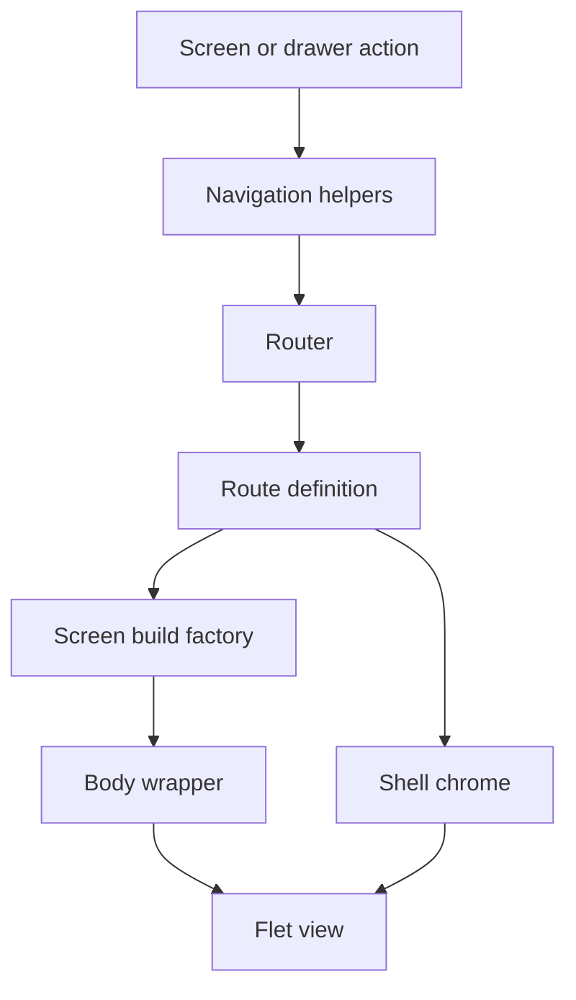
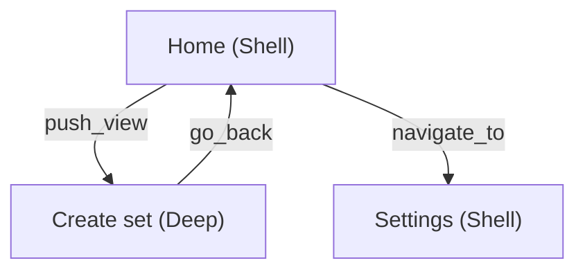

# Architecture

The application renders each URL as a Flet `ft.View`. Public navigation
helpers change the route, the router resolves a registered route definition,
and the selected screen factory supplies the view body. Route metadata keeps
screen construction, chrome, wrappers, and resize behavior separate.

## Routing flow

The flow is:

1. A screen or drawer calls a public helper from
   `ui/navigation.py`.
2. The router resolves the matching `RouteDef` in `ROUTE_REGISTRY`.
3. The route's build factory returns raw screen controls.
4. The router applies the configured body wrapper and, for Shell routes,
   shared chrome.
5. The result is added to the page as an `ft.View`.

If a build factory returns `None`, the router builds the route's
`fallback_path`, or Home when no fallback is configured. This keeps incomplete
routes, such as an edit screen without its required file parameter, out of the
view stack.

See [Routing](concepts/routing.md) for route resolution and
[Navigation](guides/navigation.md) for the public helper functions.

## Module responsibilities

| Module | Responsibility |
| --- | --- |
| `app.py` | Creates the page and application-level services. |
| `ui/navigation.py` | Exposes the supported navigation operations. |
| `ui/route_paths.py` | Defines reusable route path constants. |
| `ui/route_url.py` | Parses, builds, and compares route URLs with query parameters. |
| `ui/route_registry.py` | Declares routes and their factories, layout, chrome, drawer, and fallback metadata. |
| `ui/router.py` | Builds and restores the view stack and dispatches layout updates. |
| `ui/layout_host.py` | Wraps route bodies with the required sizing and safe-area behavior. |
| `ui/chrome_config.py` | Configures shared Shell chrome per route. |
| `ui/layout_metrics.py` | Computes reusable responsive dimensions. |
| `ui/layout_tokens.py` | Shared layout ratios and sizing constants used by metrics. |
| `ui/routable_screen.py` | `apply_layout` protocol and active-view lookup for responsive screens. |
| `ui/body_registry.py` | Shared Home and export `TilesContainer` accessors for Search. |
| `ui/app_session.py` | In-memory session bag for app-wide runtime UI services. |
| `ui/preferences.py` | `SharedPreferences` factory for durable settings. |
| `ui/screens/` | Contains route-specific controls and behavior. |

## Two navigation roles { #two-navigation-roles }

The application needs two different forms of navigation:

- **Main destinations**, such as Home and Settings, replace the current main
  screen.
- **Focused tasks**, such as creating or editing a set, open temporarily above
  the current view and return to the previous view when the task is finished.

This project calls these roles **Shell** and **Deep**. They are project
terminology, not special screen types required by Flet. In code they are
represented by `RouteKind.SHELL` and `RouteKind.DEEP`.

### Shell: a main destination

A Shell route is part of the application's main navigation:

- open it with `navigate_to()`,
- it replaces the current view stack,
- it may appear in the navigation drawer,
- it uses the shared application chrome, configured per route.

Shared chrome can include the AppBar, drawer, bottom bar, floating action
button, and search button. A route does not need to display every element.
Home, Import/Export, Settings, and Info are Shell routes.

{ .docs-screenshot }

The drawer lists Shell destinations registered with `drawer_label` /
`drawer_icon`:

{ .docs-screenshot-sm }

### Deep: a focused task

A Deep route represents a task started from another screen:

- open it with `push_view()`,
- it is added above the current view,
- the previous Shell or Deep view remains available underneath,
- it hides shared chrome,
- finish or cancel it with `go_back()` to reveal the previous view.

Create, Edit, Learn, and Search are Deep routes.

{ .docs-screenshot }

### Why the distinction exists

`RouteKind` gives the router enough information to choose whether navigation
should replace the main destination or push a temporary view. The same choice
also determines whether shared chrome is attached and what the Back action
should reveal.

The chrome and body-wrapper layers are described in
[Chrome and wrappers](concepts/chrome-and-wrappers.md).

## Continue reading

- [Add a screen](guides/adding-a-screen.md)
- [Navigate and pass route data](guides/navigation.md)
- [Implement responsive layout](guides/layout.md)
- [Choose state and persistence](guides/state-and-persistence.md)
- [Understand the body registry](concepts/body-registry.md)
