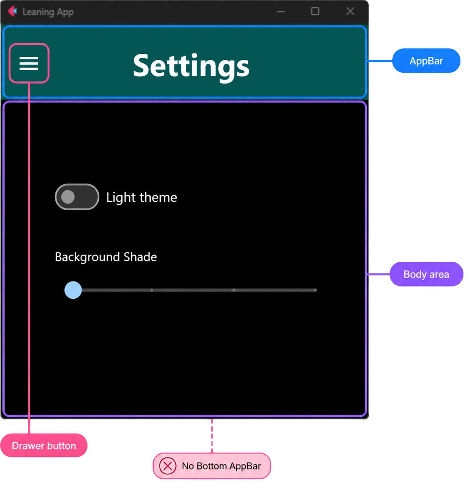

# Architecture

## Introduction

The application builds its UI from `ft.View` objects. Each route points to a screen factory, and the router creates the right view when the user navigates. Most application code should not talk to the router directly; it should use the small public navigation API from `learning_app/ui/navigation.py`.

The most important methods are:

- `navigate_to(page, route, **params)` — show a main Shell screen.
- `navigate_to_async(page, route, **params)` — async version used from async handlers, for example the drawer.
- `push_view(page, route, **params)` — open a Deep screen on top of the current screen.
- `go_back(page)` — close the current Deep screen and return to the previous screen.
- `go_search(page, mode="home")` — open search for the active tile list.

This structure keeps screen creation, navigation, chrome configuration, and responsive layout in separate places. The result is that adding a screen usually means adding one path constant, one build function, and one [`RouteDef`](#routedef).

## How to add a new screen (step by step)

### 1. Add a path in `route_paths.py`

File: `learning_app/ui/route_paths.py`

Add a constant for the new route:

```python
MY_SCREEN_ROUTE = "/my-screen"
```

Import this constant wherever you need to navigate to the screen. Do not repeat route strings manually in screen code.

### 2. Create the screen control

Screens usually live in `learning_app/ui/screens/`.

Use `learning_app/ui/screens/_screen_template.py` as the main example. It is not only a copy-paste template; it also shows how a Shell screen and a Deep screen are expected to look in this project.

A simple Shell screen can look like this:

```python
import flet as ft

from learning_app.ui.layout_metrics import LayoutMetrics
from learning_app.ui.routable_screen import RoutableScreenMixin


class MyScreen(RoutableScreenMixin, ft.Container):
    def __init__(self, page: ft.Page):
        super().__init__()
        self._app_page = page
        self.expand = True
        self.content = ft.Text("My screen")

    def apply_layout(self, metrics: LayoutMetrics | None = None) -> None:
        metrics = self.resolve_layout_metrics(metrics)
        self.width = metrics.body_width
        self.update_if_mounted()
```

`RoutableScreenMixin` is useful when the screen must react to resize events. If your screen has fixed/simple content and does not need custom sizing, you may not need [`apply_layout()`](#apply-layout).

### 3. Add a build function in `route_registry.py`

File: `learning_app/ui/route_registry.py`

A build function receives:

- `page: ft.Page` — current Flet page.
- `params: dict[str, str]` — route parameters parsed from the query string.

It returns a list of Flet controls for the view, or `None` if the route cannot be built.

Example:

```python
def _build_my_screen_controls(page: ft.Page, _params: dict[str, str]) -> list[ft.Control]:
    from learning_app.ui.layout_host import build_bottom_inset_shell_body
    from learning_app.ui.screens.my_screen import MyScreen

    return [build_bottom_inset_shell_body(page, MyScreen(page))]
```

Use local imports inside build functions. This keeps route registration simple and avoids circular imports between screens, navigation, and registry code. See [Body wrapper helpers](#body-wrapper-helpers) for the available wrappers.

### 4. Register the screen with `RouteDef`

`route_registry.py` contains `ROUTE_REGISTRY`. This is the central list of available screens. See [`route_registry`](#route-registry) for why routes are registered there.

Each entry is a [`RouteDef`](#routedef). It tells the router:

- which path belongs to the screen,
- whether the screen is Shell or Deep,
- how to build the body,
- how to handle layout,
- whether the route should appear in the drawer,
- what fallback route to use if required parameters are missing.

Example Shell route:

```python
RouteDef(
    path=MY_SCREEN_ROUTE,
    kind=RouteKind.SHELL,
    body_wrapper=BodyWrapperKind.BOTTOM_INSET_SHELL,
    layout_kind=LayoutKind.SHELL,
    chrome=SHELL_CHROME[MY_SCREEN_ROUTE],
    build_factory=_build_my_screen_controls,
    shell_layout_control=MyScreen,
    drawer_label="My screen",
    drawer_icon="STAR",
)
```

The minimum fields you should understand:

- `path` — route constant from `route_paths.py`.
- `kind` — `RouteKind.SHELL` or `RouteKind.DEEP`.
- `body_wrapper` — describes the wrapper style used by the body.
- `layout_kind` — tells the router which layout behavior to apply on resize.
- `chrome` — Shell routes use `SHELL_CHROME[...]`; Deep routes usually use `None`.
- `build_factory` — function that creates controls for the route.
- `drawer_label` and `drawer_icon` — add the route to the drawer. Omit them if the route should not be visible in the drawer.

Other fields are optional and used only when the route needs extra behavior:

- `vertical_alignment` — changes how content is aligned inside the view. For example, create/session screens can be centered.
- `shell_layout_control` — tells layout dispatch which screen type to find on Shell routes. This is useful for screens like Settings or Info.
- `drawer_divider_before` — adds a visual divider before this item in the drawer.
- `fallback_path` — route used when the build function returns `None`, for example when a Deep route is opened without a required `file` parameter.

### 5. Configure Shell chrome in `chrome_config.py`

File: `learning_app/ui/chrome_config.py`

If the route is a Shell screen, add a `ShellChromeConfig` entry:

```python
MY_SCREEN_ROUTE: ShellChromeConfig(
    appbar_title="My screen",
    appbar_menu_leading=True,
    bottom_appbar_visible=False,
    fab_visible=False,
    search_button_visible=False,
),
```

This is where you change the title of the top bar. It also controls whether the bottom bar, floating action button, and search button are visible. See [`chrome_config`](#chrome-config) for examples.

Deep screens do not need `ShellChromeConfig`, because they hide the shared app chrome.

## How to navigate and pass data

Navigation helpers live in `learning_app/ui/navigation.py`.

Import them like this:

```python
from learning_app.ui.navigation import go_back, navigate_to, push_view
from learning_app.ui.route_paths import HOME_ROUTE, SET_EDIT_ROUTE
```

### Navigate to a Shell screen

Function: `navigate_to(page, route, **params)`

Use this for main [Shell screens](#shell-screens), for example Home, Settings, Info, or Import/Export.

Parameters:

- `page` — current `ft.Page`.
- `route` — path constant from `route_paths.py`.
- `**params` — optional route parameters.

Example:

```python
navigate_to(page, HOME_ROUTE)
```

### Navigate from async handlers

Function: `navigate_to_async(page, route, **params)`

Async version of `navigate_to()`. Use it inside async handlers.

Example:

```python
await navigate_to_async(page, HOME_ROUTE)
```

The drawer uses this version because opening and closing the drawer is asynchronous.

### Open a Deep screen

Function: `push_view(page, route, **params)`

Use this for [Deep screens](#deep-screens). It opens the new screen while keeping the previous screen available for [`go_back()`](#go-back).

Example:

```python
from learning_app.ui.navigation import push_view
from learning_app.ui.route_paths import SET_EDIT_ROUTE

push_view(
    page,
    SET_EDIT_ROUTE,
    file="animals_words.csv",
    title="Animals",
)
```

The router turns these parameters into a route like:

```text
/set/edit?file=animals_words.csv&title=Animals
```

Then the route build function receives them in `params`:

```python
def _build_edit_set_controls(page: ft.Page, params: dict[str, str]) -> list[ft.Control] | None:
    file_name = params.get("file")
    title = params.get("title")
```

If a required parameter is missing, the build function can return `None`. The router will use `fallback_path` from `RouteDef`, usually `HOME_ROUTE`.

### Go back

Function: `go_back(page)`

Use this in Deep screens for Cancel, Save, or Back buttons.

Example:

```python
ft.Button(content="Cancel", on_click=lambda e: go_back(e.page))
```

### Open search

Function: `go_search(page, mode="home")`

Use this to open search for the current tile list.

Parameters:

- `page` — current `ft.Page`.
- `mode` — `"home"` or `"export"`.

Example:

```python
go_search(page, mode="export")
```

Search uses [`BodyRegistry`](#bodyregistry) internally, so it can search the same tiles that are currently shown on Home or Import/Export.

## Managing layout (UI)

### Shell screens { #shell-screens }

A Shell route is a normal application screen. It uses the shared app chrome:

- top `AppBar`,
- drawer,
- sometimes bottom bar,
- sometimes floating action button,
- sometimes search button.

{ .docs-screenshot }

Examples:

- Home
- Import/Export
- Settings
- Info

Use Shell when the screen is part of the main app navigation.

Typical route config:

```python
RouteDef(
    path=MY_SCREEN_ROUTE,
    kind=RouteKind.SHELL,
    body_wrapper=BodyWrapperKind.BOTTOM_INSET_SHELL,
    layout_kind=LayoutKind.SHELL,
    chrome=SHELL_CHROME[MY_SCREEN_ROUTE],
    build_factory=_build_my_screen_controls,
)
```

### Deep screens { #deep-screens }

A Deep route is a focused screen. It hides the app bars and is usually opened from another screen.

{ .docs-screenshot }

Examples:

- Create set
- Edit set
- Learn
- Search

Use Deep for forms, detail screens, learning sessions, and temporary flows.

Typical route config:

```python
RouteDef(
    path=MY_DEEP_ROUTE,
    kind=RouteKind.DEEP,
    body_wrapper=BodyWrapperKind.DEEP,
    layout_kind=LayoutKind.DEEP_FORM,
    chrome=None,
    build_factory=_build_my_deep_controls,
    fallback_path=HOME_ROUTE,
)
```

Open Deep screens with `push_view()`. Close them with `go_back()`.

### Body wrapper helpers { #body-wrapper-helpers }

Body wrappers live in `learning_app/ui/layout_host.py`.

They create the outer layout around your screen control.

{ .docs-screenshot }

#### Shell body

Function: `build_shell_body(page, *controls)`

Use for Shell screens that can use the full shell area.

It creates an expanding `ft.Column`, centers content horizontally, and sets its width from `LayoutMetricsStore`.

In this app it is used for screens such as Home and Import/Export:

- Home wraps `TilesContainer(page)` with `build_shell_body()`.
- Import/Export wraps `ImportExportControl(page)` with `build_shell_body()`.

Use it when the route should keep the normal shell layout and does not need the special bottom-inset behavior used by Settings or Info.

Example:

```python
return [build_shell_body(page, MyScreen(page))]
```

#### Bottom-inset shell body

Function: `build_bottom_inset_shell_body(page, *controls)`

Use for Shell screens with an AppBar but without the bottom bar, for example Settings or Info.

It wraps `build_shell_body()` in `ft.SafeArea` and sets `avoid_intrusions_top=False`. This lets the content work correctly with the AppBar area while still respecting safe areas on the other sides.

Example:

```python
def _build_my_screen_controls(page: ft.Page, _params: dict[str, str]) -> list[ft.Control]:
    from learning_app.ui.layout_host import build_bottom_inset_shell_body
    from learning_app.ui.screens.my_screen import MyScreen

    return [build_bottom_inset_shell_body(page, MyScreen(page))]
```

Use this when:

- the route is Shell,
- the top AppBar is visible,
- the bottom bar is hidden,
- the screen should fill the remaining content area.

#### Deep body

Function: `build_deep_body(page, *controls, content_alignment=...)`

Use for Deep screens.

It creates a full-screen container, adds vertical padding, and places content in a centered column with `metrics.form_width`.

Example:

```python
return [
    build_deep_body(
        page,
        MyForm(width=_content_width(page)),
        content_alignment=ft.MainAxisAlignment.CENTER,
    )
]
```

### `apply_layout()` { #apply-layout }

`apply_layout()` is the method a screen implements when it needs to resize itself.

It is called:

- when the control is mounted,
- when the page is resized,
- when the router restores an active view.

Shell screens usually use:

```python
metrics.body_width
```

Deep forms usually use:

```python
metrics.form_width
```

Example:

```python
def apply_layout(self, metrics: LayoutMetrics | None = None) -> None:
    metrics = self.resolve_layout_metrics(metrics)
    self.width = metrics.body_width
    self.update_if_mounted()
```

This pattern keeps resize logic inside the screen instead of spreading width calculations across the router.

## What the main routing pieces mean

### `route_registry` { #route-registry }

`route_registry.py` is the central list of screens. It is the place where the app answers: “which route exists, how do I build it, and how should it behave?”

This avoids route-specific logic being scattered across buttons, drawer code, and router conditionals.

### `BodyRegistry` { #bodyregistry }

`BodyRegistry` stores references to currently active tile containers. It is used by Home, Import/Export, and Search.

Search needs this because it should filter the same list of tiles the user is already viewing. For example, `go_search(page, mode="home")` searches Home tiles, while `go_search(page, mode="export")` searches Import/Export tiles.

Do not use `BodyRegistry` as general global state. Use it only for shared UI bodies that must be reused by another route.

### `RouteDef` { #routedef }

`RouteDef` is one route description. It connects a route path with:

- screen type (`SHELL` or `DEEP`),
- layout behavior,
- chrome configuration,
- build function,
- drawer metadata,
- fallback behavior.

When you add a screen, `RouteDef` is the main place where you register it.

### `chrome_config` { #chrome-config }

`chrome_config.py` contains `SHELL_CHROME`, a dictionary of per-route `ShellChromeConfig` objects.

Use it to change:

- AppBar title,
- whether the menu button appears in the AppBar,
- bottom bar visibility,
- FAB visibility,
- search button visibility.

This keeps visual shell settings away from screen business logic.

Two examples of Shell chrome configuration:

=== "Full Shell chrome"

    { .docs-screenshot }

    Home keeps the full shell frame: AppBar, drawer, bottom bar, search, and FAB.

=== "Reduced Shell chrome"

    { .docs-screenshot }

    Settings keeps the AppBar, but hides the bottom bar, search, and FAB.

### Shell { #shell }

Shell means “screen inside the main application frame”. It has the shared chrome and can be listed in the drawer.

Use it for top-level app screens.

### Deep { #deep }

Deep means “focused screen opened from another screen”. It hides the shared chrome and is normally closed with `go_back()`.

Use it for forms, detail screens, and learning flows.

### `apply_layout` { #apply-layout-concept }

`apply_layout()` is the resize hook for screens. It receives optional `LayoutMetrics` and updates widths, heights, or nested controls.

This gives each screen ownership of its own layout details.

### `AppSession` { #appsession }

`AppSession` stores app-global runtime objects, not screen-specific state.

Use it for things that should exist once for the whole running app, for example:

- current `ft.Page`,
- shared `FilePicker`,
- navigation lock flag.

Do not use it as a general dumping ground for every screen value.

## Where to store global data

Use [`AppSession`](#appsession) for runtime objects that live only while the app is running.

Examples:

- current `ft.Page`,
- shared file picker,
- temporary flag that disables navigation.

Use Flet `SharedPreferences` for persisted values that should survive app restart.

The helper is in `learning_app/ui/preferences.py`:

```python
from learning_app.ui.preferences import get_shared_preferences

storage = get_shared_preferences()
await storage.set("theme_mode", ft.ThemeMode.DARK.value)
theme_mode = await storage.get("theme_mode")
```

Current examples include theme mode and theme slider values.

Rule of thumb:

- `AppSession` — runtime-only, app-wide objects.
- `SharedPreferences` — small persisted settings.
- Screen control fields — local UI state.
- Route params — data needed to open a specific screen.

## Why this architecture is useful

This structure gives a few practical benefits:

- Adding a screen is predictable: path, build function, `RouteDef`.
- Navigation code stays small and consistent.
- Drawer items are derived from the route registry.
- Shell and Deep screens behave consistently.
- Resize logic stays inside screens through `apply_layout()`.
- Top bar and bottom bar settings are configured in one place.
- Global runtime state is separated from persisted preferences.

For day-to-day work, start from `learning_app/ui/screens/_screen_template.py`, add the route path, register a `RouteDef`, and navigate with helpers from `navigation.py`.
