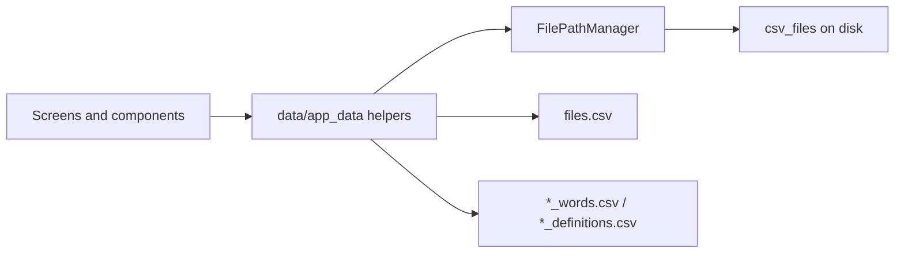

# Data and storage

Learning sets and progress are stored as CSV files on disk. The UI routing
layer does not own this data: screens call helpers in `data/` to resolve
paths, update the set catalog, and load or save tables.

Do not put set content, row statistics, or catalog rows in `AppSession` or
`BodyRegistry`. Those modules hold UI runtime objects only. See
[State and persistence](../guides/state-and-persistence.md).

## Storage layout

`FilePathManager` in `data/file_path_manager.py` resolves directories from Flet
environment variables:

| Path | Source | Contents |
| --- | --- | --- |
| Application data root | `FLET_APP_STORAGE_DATA` | Platform storage for the app |
| CSV directory | `{data}/csv_files/` | Set files and the catalog |
| Catalog | `csv_files/files.csv` | Titles and file names for every set |
| Temporary directory | `FLET_APP_STORAGE_TEMP` | Short-lived files when the platform provides it |

Call `FilePathManager.initialize()` once at startup (already done in
`app.py`) so `csv_files/` exists before any load or save. When
`FLET_APP_STORAGE_DATA` is unset (for example some web setups), the manager
falls back to the process current working directory as the CSV directory.

Helpers such as `get_csv_path()` and `get_files_data_path()` always go through
this manager so screens never hard-code absolute paths.

See the [File path manager API](../reference/file_path_manager.md).

## Set catalog: `files.csv`

The catalog lists every learning set the Home and export UIs can show.
Columns come from `FilesColumns` in `data/constants.py`:

| Column | Meaning |
| --- | --- |
| `file_name` | Basename of the set CSV (`…_words.csv` or `…_definitions.csv`) |
| `title` | Display title on tiles |
| `subtitle` | Optional secondary text |

Catalog helpers in `data/app_data.py`:

- `get_file_names_and_titles()` / `get_file_names()` — read the catalog
  (creating an empty `files.csv` when missing).
- `add_new_file()` — append a catalog row after a new set file exists.
- `delate_set()` — remove the catalog row and delete the set file when present.
- `generate_empty_files_data()` — create an empty catalog with the expected
  columns.

`get_file_names_and_titles()` returns full paths via `FilePathManager` so tile
code can open the matching CSV without recomputing directories.

## Set files: words and definitions

Each set is one CSV whose name must end with `_words.csv` or
`_definitions.csv`. `get_kind_of_file_and_validate()` enforces that suffix.
`sanitize_file_name()` strips non-alphanumeric characters and appends the
kind suffix when creating names.

### Words schema

Content columns (`PartsOfSpeech`): `verb`, `person`, `thing`, `adjective`,
`adverb`.

### Definitions schema

Content columns (`WordDefinitions`): `definition`, `word`.

### Shared statistics columns

Every set also stores progress columns (`StatsColumns`):

| Column | Role |
| --- | --- |
| `correct_answers` | Integer count of successful answers |
| `good_answer` | Last-answer / known-state flag |
| `good_answers_in_a_row` | Streak flag used by the learning queue |
| `word_to_learn` | Priority flag for the next draw group |

`create_empty_set(kind)` builds an empty DataFrame with the correct columns
and dtypes. `load_set` / `save_set` read and write through
`FilePathManager.get_csv_path()`, keeping the DataFrame index in the CSV
(`index_col=0` on load, `index=True` on save).

`MAX_ROWS` in `data/constants.py` caps how many content rows a set may
contain (currently `40`). Import validation enforces that limit.

`set_default_progress(file_name)` resets all statistics columns on an
existing set without removing content rows.

See the [Constants API](../reference/constants.md) and
[App data API](../reference/app_data.md).

## `AppData` versus catalog helpers

Module-level functions in `data/app_data.py` manage the catalog and raw
DataFrames on disk. The `AppData` class loads one set into memory for a
learning session, draws word groups from the statistics columns, and calls
`save_set` after each answer.

Use the helpers when listing, creating, deleting, or editing sets. Use
`AppData` when running a learn session over an existing file. Queue and
answer rules are documented in
[Learning algorithm](../concepts/learning-algorithm.md); storage ownership
stays in this layer either way.

## Import path (overview)

`CSVProcessor` in `data/csv_processor.py` validates imported files, may repair
`files.csv`, and saves sets with or without keeping existing statistics. The
full task flow is in the [Import and export guide](../guides/import-export.md).
Column and message enums for errors and warnings live in `data/constants.py`.

## Module map

| Module | Responsibility |
| --- | --- |
| `data/file_path_manager.py` | Storage roots and CSV path resolution |
| `data/constants.py` | Schema enums, `MAX_ROWS`, import messages |
| `data/app_data.py` | Catalog CRUD, load/save, empty sets, `AppData` |
| `data/csv_processor.py` | Import validation and specialized save paths |

## Continue reading

- [Architecture overview](index.md)
- [Learning algorithm](../concepts/learning-algorithm.md)
- [Import and export](../guides/import-export.md)
- [State and persistence](../guides/state-and-persistence.md)
- [File path manager API](../reference/file_path_manager.md)
- [App data API](../reference/app_data.md)
- [Constants API](../reference/constants.md)
- [CSV processor API](../reference/csv_processor.md)
