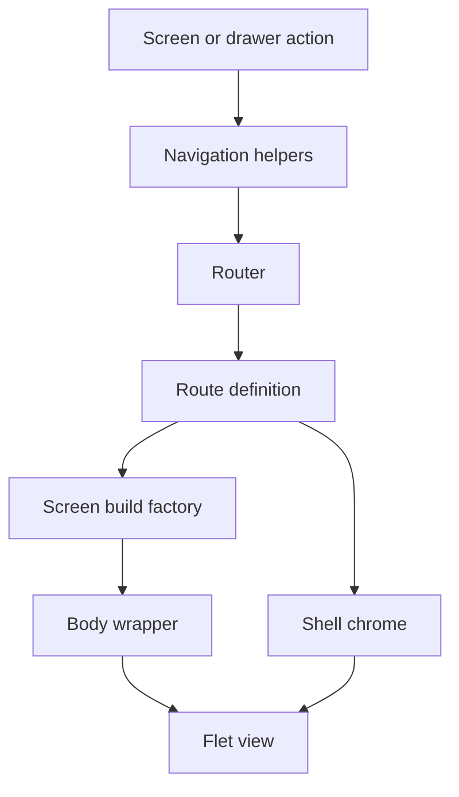
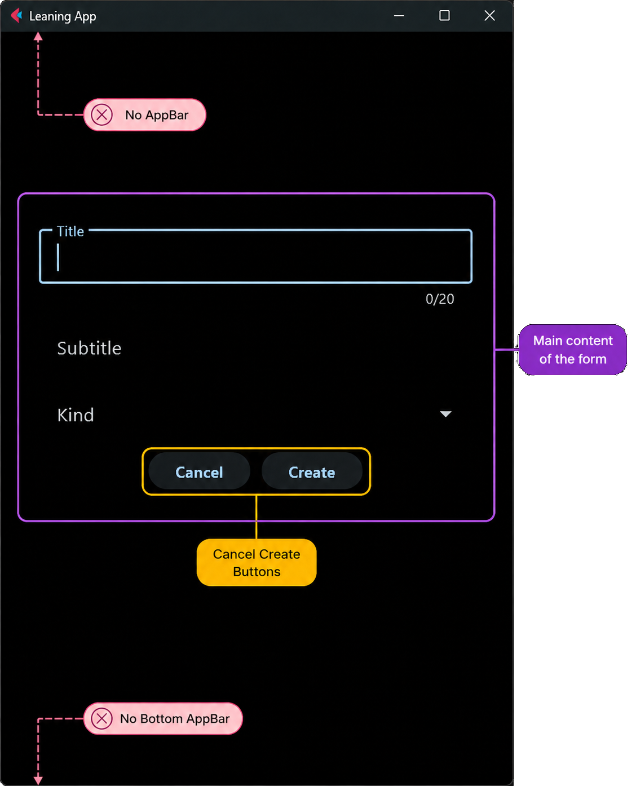
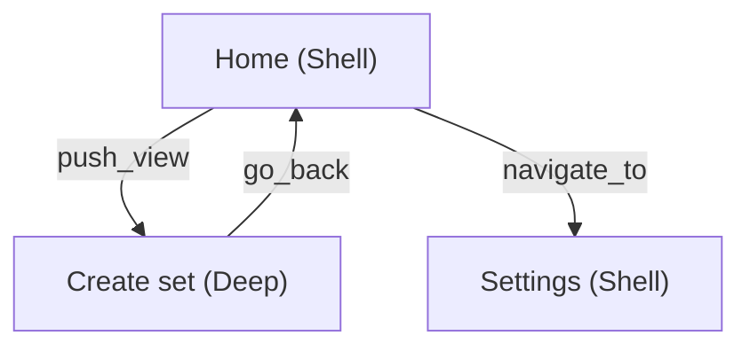

# Routing and screens

Public navigation helpers change the route, the router resolves a registered
`RouteDef`, and the selected factory supplies the view body. Route metadata
keeps construction, chrome, wrappers, and resize behavior separate from
screen business logic.

Symbol-level registration is in [Routing](../concepts/routing.md). Day-to-day
calls are in the [Navigation guide](../guides/navigation.md). To add a route,
use [Adding a screen](../guides/adding-a-screen.md).

## Routing flow

The flow is:

1. A screen or drawer calls a public helper from `ui/navigation.py`.
2. The router resolves the matching `RouteDef` in `ROUTE_REGISTRY`.
3. The route's build factory returns raw screen controls.
4. The router applies the configured body wrapper and, for Shell routes,
   shared chrome.
5. The result is added to the page as an `ft.View`.

If a build factory returns `None`, the router builds the route's
`fallback_path`, or Home when no fallback is configured, and syncs the page
URL to that fallback. Factories for learn, session, and existing-set edit also
return `None` when the set CSV is missing (for example after delete + browser
Back). Edit with create-set query params (`title`) also returns `None` when
that CSV already exists, so browser history cannot re-open a create flow that
would duplicate the catalog entry. This keeps incomplete or stale deep links
out of the view stack.

## Two navigation roles { #two-navigation-roles }

The application needs two different forms of navigation:

- **Main destinations**, such as Home and Settings, replace the current main
  screen.
- **Focused tasks**, such as creating or editing a set, open temporarily above
  the current view and return to the previous view when the task is finished.

This project calls these roles **Shell** and **Deep**. They are project
terminology, not special screen types required by Flet. In code they are
represented by `RouteKind.SHELL` and `RouteKind.DEEP`.

### Shell: a main destination

A Shell route is part of the application's main navigation:

- open it with `navigate_to()`,
- it replaces the current view stack,
- it may appear in the navigation drawer,
- it uses the shared application chrome, configured per route.

Shared chrome can include the AppBar, drawer, bottom bar, floating action
button, and search button. A route does not need to display every element.
Home, Import/Export, Settings, and Info are Shell routes.

{ .docs-screenshot }

The drawer lists Shell destinations registered with `drawer_label` /
`drawer_icon`:

{ .docs-screenshot-sm }

### Deep: a focused task

A Deep route represents a task started from another screen:

- open it with `push_view()`,
- it is added above the current view,
- the previous Shell or Deep view remains available underneath,
- it hides shared chrome,
- finish or cancel it with `go_back()` to reveal the previous view.

Create, Edit, and Learn are Deep routes.

{ .docs-screenshot }

### Why the distinction exists

`RouteKind` gives the router enough information to choose whether navigation
should replace the main destination or push a temporary view. The same choice
also determines whether shared chrome is attached and what the Back action
should reveal.

The chrome and body-wrapper layers (including live `AppChrome` / `AppDrawer`)
are described in [Chrome and wrappers](../concepts/chrome-and-wrappers.md).

## Screen map

Paths are constants in `ui/route_paths.py`. Factories and `RouteDef` entries
live in `ui/route_registry.py`. Home has no dedicated screen class: the factory
builds a `TilesContainer` and registers it with
[Body registry](../concepts/body-registry.md).

| Path | Kind | Class / body | Role |
| --- | --- | --- | --- |
| `/` | Shell | `TilesContainer` | Learning-set list (Home) |
| `/import-export` | Shell | `ImportExportControl` | Import CSV and export tiles |
| `/settings` | Shell | `SettingsControl` | Appearance (theme) and demo-set install ([Theming](../guides/state-and-persistence.md#theming), [Demo sets](data-and-storage.md#demo-sets)) |
| `/info` | Shell | `InfoControl` | In-app product information |
| `/create-set` | Deep | `CreateSetMenu` | Create an empty set, then open edit |
| `/set/edit` | Deep | `EditSetMenu` | Edit cards for one set |
| `/set/learn` | Deep | `WordFields` or `WordDefinitionField` (`session=False`) | Learn menu / word list |
| `/set/learn/session` | Deep | Same control (`session=True`) | Active learn session |

Search is not a route: `go_search()` opens in-place search over the Home or
export `TilesContainer` (see [Body registry](../concepts/body-registry.md)).

### Learn: menu then session

Learn is two Deep routes over the same control family:

1. `/set/learn` opens the menu (`session=False`) with progress and word list.
2. Starting practice navigates to `/set/learn/session` (`session=True`), which
   runs the `AppData` queue described in
   [Learning algorithm](../concepts/learning-algorithm.md).

The factory picks `WordFields` or `WordDefinitionField` from the set file
suffix (`_words.csv` vs `_definitions.csv`).

### Related tasks

| Task | Doc |
| --- | --- |
| Register a new route | [Adding a screen](../guides/adding-a-screen.md) |
| Call navigation helpers | [Navigation](../guides/navigation.md) |
| Import / export screen behavior | [Import and export](../guides/import-export.md) |
| Search and shared tiles | [Body registry](../concepts/body-registry.md) |
| Component building blocks | [UI components](../concepts/ui-components.md) |

## Continue reading

- [Architecture overview](index.md)
- [Startup and lifecycle](startup.md)
- [Routing concept](../concepts/routing.md)
- [Adding a screen](../guides/adding-a-screen.md)
- [Navigation guide](../guides/navigation.md)
