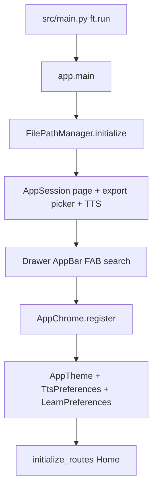

# Startup and lifecycle

Source: `app.py` (`main`), launched from `src/main.py` via `ft.run(main)`

Application startup builds shared chrome and runtime services **before** the
first routed view. Order matters: storage and session must exist before CSV
UI runs, chrome controls must be registered before the router attaches them
to Shell views, and theme, TTS, and learn preferences should load before the home
route is shown.



There is no separate API page for `app.py`. The steps below link to the
modules each phase configures.

## Bootstrap order

### 1. Storage paths

```python
FilePathManager.initialize()
```

Creates `csv_files/` under Flet storage (or falls back to the working
directory). Any later catalog or set I/O assumes this ran first.

See [Data and storage](data-and-storage.md) and the
[File path manager API](../reference/file_path_manager.md).

### 2. Page session services

```python
AppSession.set_page(page)
AppSession.get_export_csv_picker()
AppSession.init_tts(page)
```

Stores the live `ft.Page`, lazily creates the shared CSV export
`FilePicker` used by tile export actions, and creates one `TtsService`.
The `flet_audio.Audio` player is **not** mounted here: Flutter's
`AudioService` throws if `src` is empty, so `AppSession.speak` constructs
the player on first use with a real filesystem path already set (forward
slashes, not a `file://` URI). Screens call `AppSession.speak(text, language)`
instead of constructing `Audio` or `GttsProvider`. Import uses a separate
picker owned by `ImportExportControl` — do not reuse the export picker for
choosing an import file.

See [State and persistence](../guides/state-and-persistence.md) and the
[App session API](../reference/app_session.md).

### 3. Drawer and page chrome controls

`AppDrawer` is assigned to `page.drawer`. The shared AppBar (title from
`Greetings.get_greeting()` in `utils/greetings.py`), BottomAppBar (menu +
search), and FAB (create set) are constructed with the hardcoded teal
`colors` map in `app.py`.

Handlers wired here:

| Control / event | Behavior |
| --- | --- |
| FAB | `push_view` to create-set after refreshing layout metrics |
| Bottom / AppBar menu | `page.show_drawer()` |
| Search | On Import/Export → `go_search(..., mode="export")`; otherwise `"home"`. Visibility on Import/Export is toggled by the Export tab (see [Import and export](../guides/import-export.md#search-on-the-export-tab)). |
| `page.on_resized` | `handle_page_resize` |

Shell chrome *visibility* per route still comes from `SHELL_CHROME` later,
when the router builds a view. Startup only creates the shared control
instances.

See [Chrome and wrappers](../concepts/chrome-and-wrappers.md) (config vs
[runtime](../concepts/chrome-and-wrappers.md#runtime-appchrome)),
[Chrome configuration API](../reference/chrome_config.md), and
[App chrome API](../reference/app_chrome.md).

### 4. Route and view-pop handlers

```python
page.on_route_change = handle_route_change
page.on_view_pop = handle_view_pop
```

Flet delivers navigation events to the router. These assignments happen
before the first `initialize_routes` call so the initial Home navigation is
handled consistently.

See the [Router API](../reference/router.md) and
[Routing](../concepts/routing.md).

### 5. Register chrome with `AppChrome`

```python
AppChrome.register(
    appbar=page.appbar,
    bottom_appbar=page.bottom_appbar,
    floating_action_button=...,
    ...
)
```

The router and Shell chrome sync look up these refs instead of reading
`page.*` ad hoc. Register after the controls exist and before routes build
Shell views that attach them. See
[App chrome API](../reference/app_chrome.md).

### 6. Theme, TTS, and learn preferences

Default theme keys are written when missing (`theme_mode`, light/dark
background and slider values). The page theme mode and bgcolor are applied,
then:

```python
await AppTheme.load_from_preferences()
AppTheme.sync_from_page(page)
await TtsPreferences.load_from_preferences()
await LearnPreferences.load_from_preferences()
```

Theme, TTS, and Learning *settings UI* is owned by Settings; startup only
restores the last saved look, speech options, and learn-queue retry so the
first frame matches preferences. Keys and ownership are in
[State and persistence](../guides/state-and-persistence.md)
([Theming](../guides/state-and-persistence.md#theming),
[Text to speech](../guides/state-and-persistence.md#text-to-speech),
[Learning](../guides/state-and-persistence.md#learning)).

See [Preferences API](../reference/preferences.md),
[App theme API](../reference/app_theme.md),
[TTS preferences API](../reference/tts_preferences.md), and
[Learn preferences API](../reference/learn_preferences.md).

### 7. Initial route

```python
await initialize_routes(page)
```

Replaces the view stack with Home (`reset_to_route` → `HOME_ROUTE`). From
this point, navigation helpers and route events own stack changes.

See [Navigation](../guides/navigation.md).

## Why this order

| If you skip or reorder… | Risk |
| --- | --- |
| Paths after first CSV use | Missing `csv_files/` or wrong roots |
| Session after export/import UI | No shared page or picker |
| `AppChrome.register` after first Shell view | Chrome sync cannot find controls |
| Theme / TTS / learn prefs after `initialize_routes` | First Home paint may flash wrong theme; Settings TTS and Learning controls may show defaults |
| Route handlers after `initialize_routes` | Initial navigation may miss router logic |

Hardcoded chrome colors in `app.py` are separate from preference-backed page
background. Changing Shell teal requires editing that map; changing content
background goes through Settings / `AppTheme`.

## Continue reading

- [Architecture overview](index.md)
- [Routing and screens](routing-and-screens.md)
- [Data and storage](data-and-storage.md)
- [State and persistence](../guides/state-and-persistence.md) (incl. [Theming](../guides/state-and-persistence.md#theming), [Text to speech](../guides/state-and-persistence.md#text-to-speech), and [Learning](../guides/state-and-persistence.md#learning))
- [Chrome and wrappers](../concepts/chrome-and-wrappers.md)
- [Router API](../reference/router.md)
- [App chrome API](../reference/app_chrome.md)
- [App drawer API](../reference/app_drawer.md)
- [App session API](../reference/app_session.md)
- [App theme API](../reference/app_theme.md)
- [TTS preferences API](../reference/tts_preferences.md)
- [Learn preferences API](../reference/learn_preferences.md)
- [File path manager API](../reference/file_path_manager.md)
- [Preferences API](../reference/preferences.md)
