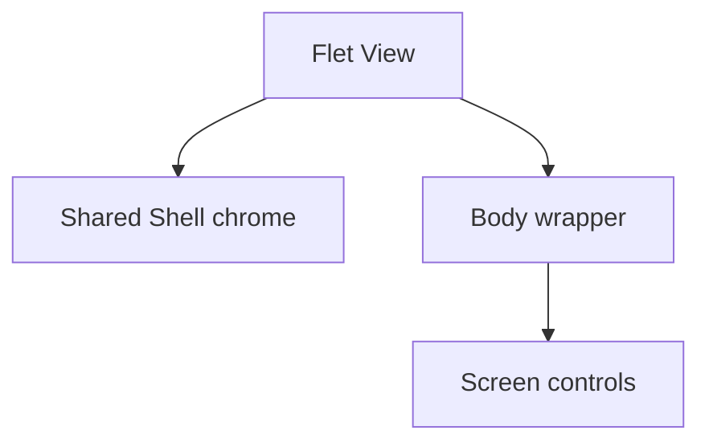
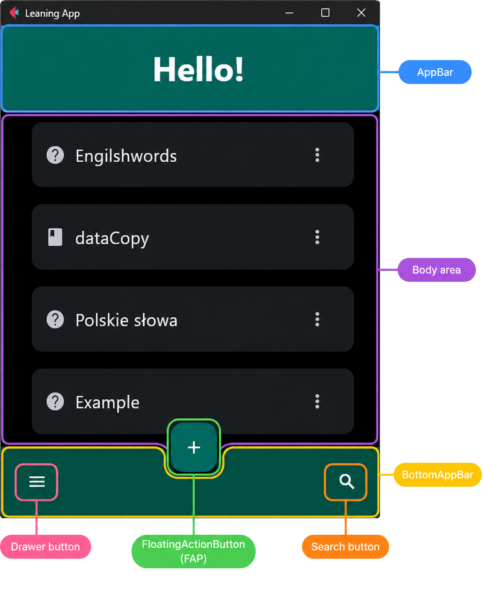
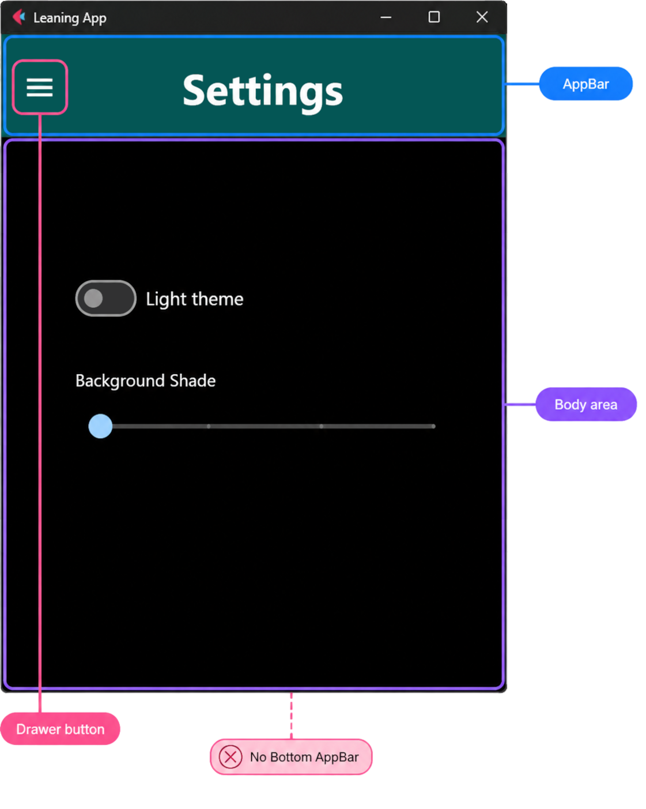
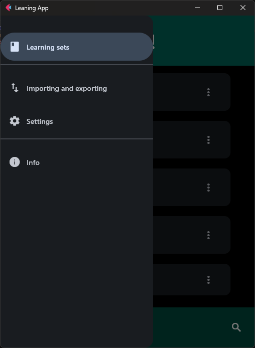

# Chrome and wrappers

Chrome and body wrappers solve different layout problems. **Chrome** is the
shared application frame around a Shell screen. A **wrapper** is the container
around route controls inside the available view body.

They are separate parts of the routed view:



Chrome is attached through `ft.View` properties such as `appbar`, `drawer`,
`bottom_appbar`, and `floating_action_button`. The wrapper is the root control
inside `ft.View.controls`; it contains the screen body.

## Config vs runtime

Two layers work together:

| Layer | Module | Role |
| --- | --- | --- |
| Declarative config | `ui/chrome_config.py` | Per-route `ShellChromeConfig` in `SHELL_CHROME` (titles, visibility flags). |
| Live registry | `ui/app_chrome.py` | `AppChrome` holds the real AppBar / bottom bar / FAB / drawer instances. |
| Drawer UI | `ui/app_drawer.py` | `AppDrawer` builds tiles and navigates on selection. |

`SHELL_CHROME` answers *what should this Shell route look like*. `AppChrome`
answers *where are the shared controls so the router can mutate them*. Startup
creates the controls once, registers them, then the router applies config from
`SHELL_CHROME[path]` on each Shell (or Deep) transition. Existing `RouteDef`
entries also store `chrome=SHELL_CHROME[…]` for registry consistency, but the
router does not read `route_def.chrome` — path lookup in `SHELL_CHROME` is the
runtime source of truth.

## Shell chrome

`ui/chrome_config.py` contains the per-route `SHELL_CHROME`
configuration. It controls the AppBar title and menu button, bottom bar,
floating action button, and search button. Deep routes have no shared chrome.

A typical Shell route such as Home shows the full chrome around the body:

{ .docs-screenshot }

Settings demonstrates reduced Shell chrome: it retains the AppBar while
hiding the bottom bar, search button, and floating action button.

```python
SHELL_CHROME = {
    # ...
    SETTINGS_ROUTE: ShellChromeConfig(
        appbar_title="Settings",
        appbar_menu_leading=True,
        bottom_appbar_visible=False,
        fab_visible=False,
        search_button_visible=False,
    ),
}
```

{ .docs-screenshot }

See the [routing and screens](../architecture/routing-and-screens.md#two-navigation-roles) overview for
the Shell and Deep screen forms.

## Runtime: `AppChrome`

`AppChrome` in `ui/app_chrome.py` is a process-wide registry of the shared
chrome controls built in `app.py`. After construction:

```python
AppChrome.set_drawer(drawer)
AppChrome.register(
    appbar=page.appbar,
    bottom_appbar=page.bottom_appbar,
    floating_action_button=page.floating_action_button,
    ...
)
```

The router then:

1. Looks up `SHELL_CHROME[path]` for Shell routes and sets visibility, AppBar
   title (including the `__greeting__` sentinel), leading menu button, and FAB.
2. Hides AppBar, bottom bar, and FAB for Deep routes.
3. Attaches the same registered controls onto each Shell `ft.View` (plus
   drawer and alignment defaults from `AppChrome`).
4. Updates `AppChrome.get_drawer().selected_index` so the drawer highlights
   the active Shell destination.

Layout metrics also read AppBar / bottom-bar heights through `AppChrome` when
computing available body space. `AppSession` disable/enable navigation toggles
the drawer via `has_drawer` / `get_drawer`.

Register before the first Shell view is built; see
[Startup](../architecture/startup.md). Do not recreate AppBar or FAB per
route — mutate the registered instances.

## Runtime: `AppDrawer`

`AppDrawer` in `ui/app_drawer.py` subclasses `ft.NavigationDrawer`. Tiles come
from `build_drawer_controls()` / `DRAWER_ROUTES` in `ui/route_registry.py`.
On change it closes the drawer and calls `navigate_to_async` unless the
selected route is already current, or navigation is locked in `AppSession`.

The drawer is assigned to `page.drawer` and registered with
`AppChrome.set_drawer` so Shell views and chrome sync share one instance.

{ .docs-screenshot-sm }

## Body wrappers

Wrappers in `ui/layout_host.py` centralize sizing, padding, and
safe-area behavior. The router chooses one from `RouteDef.body_wrapper`;
screen factories return only their raw controls.

| Wrapper | Helper | Typical routes |
| --- | --- | --- |
| `BodyWrapperKind.SHELL` | `build_shell_body` | Home, Import/Export |
| `BodyWrapperKind.BOTTOM_INSET_SHELL` | `build_bottom_inset_shell_body` | Settings, Info |
| `BodyWrapperKind.DEEP` | `build_deep_body` | Create, Edit, Learn |
| `BodyWrapperKind.SEARCH` | `build_search_body` | Search |

`SHELL` provides the normal expanding body area. `BOTTOM_INSET_SHELL` adds
safe-area handling for Shell screens that have an AppBar but no bottom bar.
`DEEP` provides full-screen form sizing and vertical padding. `SEARCH`
provides search-specific body structure.

## Why Settings needs a different wrapper

The Settings chrome configuration hides the bottom app bar but keeps the
AppBar. Its route therefore uses
`BodyWrapperKind.BOTTOM_INSET_SHELL`, which wraps the normal Shell body in
`ft.SafeArea`.

On a phone, route content can otherwise overlap:

- the status bar, camera cutout, or notch at the top,
- rounded screen edges,
- the gesture area or Back, Home, and Recent apps controls at the bottom.

For Settings, the AppBar already owns the top inset. The wrapper therefore
uses `avoid_intrusions_top=False` while retaining protection on the sides and
bottom:

```python
return wrap_safe_area(
    build_shell_body(page, *controls),
    avoid_intrusions_top=False,
)
```

Home and Import/Export use `BodyWrapperKind.SHELL` because their shared chrome
already defines the normal Shell body area. Search has no shared chrome and
uses `BodyWrapperKind.SEARCH`, which protects every safe-area edge. The Deep
form wrapper supplies form width and vertical padding; it does not add an
`ft.SafeArea`.

Keeping these decisions in wrapper helpers prevents individual screens from
reimplementing route-frame calculations.

See the [Chrome configuration API](../reference/chrome_config.md),
[App chrome API](../reference/app_chrome.md),
[App drawer API](../reference/app_drawer.md), and
[Layout host API](../reference/layout_host.md) for generated field and helper
contracts.
