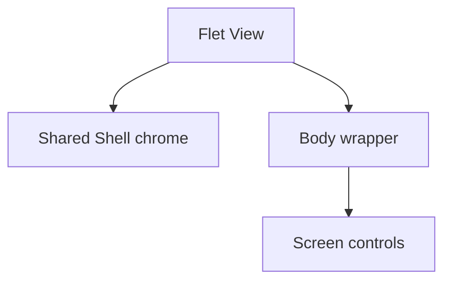

# Chrome and wrappers

Chrome and body wrappers solve different layout problems. **Chrome** is the
shared application frame around a Shell screen. A **wrapper** is the container
around route controls inside the available view body.

They are separate parts of the routed view:



Chrome is attached through `ft.View` properties such as `appbar`, `drawer`,
`bottom_appbar`, and `floating_action_button`. The wrapper is the root control
inside `ft.View.controls`; it contains the screen body.

## Shell chrome

`chrome_config.py` contains the per-route `SHELL_CHROME` configuration. It
controls the AppBar title and menu button, bottom bar, floating action button,
and search button. Deep routes have no shared chrome.

Settings demonstrates reduced Shell chrome: it retains the AppBar while
hiding the bottom bar, search button, and floating action button.

```python
SHELL_CHROME = {
    # ...
    SETTINGS_ROUTE: ShellChromeConfig(
        appbar_title="Settings",
        appbar_menu_leading=True,
        bottom_appbar_visible=False,
        fab_visible=False,
        search_button_visible=False,
    ),
}
```

{ .docs-screenshot }

See the [architecture overview](../architecture.md#two-navigation-roles) for
the Shell and Deep screen forms.

## Body wrappers

Wrappers in `layout_host.py` centralize sizing, padding, and safe-area behavior.
The router chooses one from `RouteDef.body_wrapper`; screen factories return
only their raw controls.

| Wrapper | Helper | Typical routes |
| --- | --- | --- |
| `BodyWrapperKind.SHELL` | `build_shell_body` | Home, Import/Export |
| `BodyWrapperKind.BOTTOM_INSET_SHELL` | `build_bottom_inset_shell_body` | Settings, Info |
| `BodyWrapperKind.DEEP` | `build_deep_body` | Create, Edit, Learn |
| `BodyWrapperKind.SEARCH` | `build_search_body` | Search |

`SHELL` provides the normal expanding body area. `BOTTOM_INSET_SHELL` adds
safe-area handling for Shell screens that have an AppBar but no bottom bar.
`DEEP` provides full-screen form sizing and vertical padding. `SEARCH`
provides search-specific body structure.

## Why Settings needs a different wrapper

The Settings chrome configuration hides the bottom app bar but keeps the
AppBar. Its route therefore uses
`BodyWrapperKind.BOTTOM_INSET_SHELL`, which wraps the normal Shell body in
`ft.SafeArea`.

On a phone, route content can otherwise overlap:

- the status bar, camera cutout, or notch at the top,
- rounded screen edges,
- the gesture area or Back, Home, and Recent apps controls at the bottom.

For Settings, the AppBar already owns the top inset. The wrapper therefore
uses `avoid_intrusions_top=False` while retaining protection on the sides and
bottom:

```python
return wrap_safe_area(
    build_shell_body(page, *controls),
    avoid_intrusions_top=False,
)
```

Home and Import/Export use `BodyWrapperKind.SHELL` because their shared chrome
already defines the normal Shell body area. Search has no shared chrome and
uses `BodyWrapperKind.SEARCH`, which protects every safe-area edge. The Deep
form wrapper supplies form width and vertical padding; it does not add an
`ft.SafeArea`.

Keeping these decisions in wrapper helpers prevents individual screens from
reimplementing route-frame calculations.

See the [Chrome configuration API](../reference/chrome_config.md) and
[Layout host API](../reference/layout_host.md) for generated field and helper
contracts.
