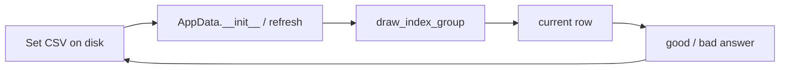

# Learning algorithm

Source: `data/app_data.py` (`AppData`)

Learn sessions keep one set in memory as an `AppData` instance. Statistics
columns on each row drive which items are drawn next. After every answer the
table is written back with `save_set`, so progress survives leaving the
screen.



Catalog CRUD and path resolution stay outside this class. See
[Data and storage](../architecture/data-and-storage.md). UI learn controls such
as `BaseWordField` in `ui/components/base_word_field.py` construct `AppData`
when a learn session starts; they do not reimplement queue rules.

## Statistics columns

Each set row stores four columns from `StatsColumns`:

| Column | Type | Meaning in the algorithm |
| --- | --- | --- |
| `correct_answers` | int | Lifetime count of correct answers for the row |
| `good_answer` | bool | Whether the latest answer was correct |
| `good_answers_in_a_row` | bool | Whether consecutive correct answers have been confirmed |
| `word_to_learn` | bool | Whether the row is prioritized for practice |

Developers often write the three booleans as `good_answer` /
`good_answers_in_a_row` / `word_to_learn`, abbreviated `G/S/W` or as a
`0/0/0` triple in user-facing copy.

| Named state | `G/S/W` | Typical meaning |
| --- | --- | --- |
| Unknown | `0/0/1` | Failed recently; marked to learn |
| Unverified | `0/0/0` | Not yet confirmed through practice |
| Unconfirmed known | `1/0/0`, `1/0/1`, `1/1/1` | Correct recently but not fully learned |
| Known | `1/1/0` | Correct streak confirmed; not marked to learn |

`number_of_known_words()` counts the Known triple. Progress reset uses
module-level `set_default_progress(file_name)`, which sets all four columns
to their defaults (`0` / `False` / `False` / `False`) and saves the file.

## Drawing a practice group

`draw_index_group()` builds up to ten row indexes for the current round:

1. Take rows in the Unknown state (`0/0/1`).
2. If fewer than ten, add Unverified rows (`0/0/0`), preferring lower
   `correct_answers`.
3. If still short, add Unconfirmed-known combinations, again preferring lower
   `correct_answers`.
4. Sample at most ten indexes into `current_group_of_indexes`.

```python
count = self.words.draw_index_group(save_indexes_in_class_art=True)
if count == 0:
    # nothing left to practice in this session setup
    ...
```

When `save_indexes_in_class_art=True`, the drawn indexes are also stored on
`AppData.last_group_of_indexes` for UI helpers such as
`was_this_index_drawn()` (the learn menu **Previous session** chip). That list
is kept when leaving a session — including forced back — so the chip still
reflects the queue the user had started. Leaving the learn menu via its Back
button clears the list through `delete_last_group_of_indexes()`.

`draw_new_row()` advances through the group. `it_is_not_last_index_of_group()`
reports whether more indexes remain before the group is cleared.

## Answer transitions

Both answer helpers mutate the current row and call `save_set` immediately.

### Correct: `good_answer_at_current_row()`

- Increments `correct_answers`.
- Sets `good_answer` to `True`.
- If the previous answer was already correct, sets `good_answers_in_a_row`
  to `True`.
- Special cases clear `word_to_learn` when the row has completed the
  confirmation path used by the queue (see implementation for the
  `1/1/1` and `1/0/1` branches).

### Incorrect: `bad_answer_at_current_row()`

- Sets `good_answer` and `good_answers_in_a_row` to `False`.
- Sets `word_to_learn` to `True` so the next draw prioritizes the row.

```python
if answer_ok:
    self.words.good_answer_at_current_row()
else:
    self.words.bad_answer_at_current_row()
```

## Progress helpers

| Method | Use |
| --- | --- |
| `number_of_known_words()` | Count Known rows (`1/1/0`) |
| `number_of_learning_words()` | Count rows still in the learning mix |
| `number_of_all_words()` | Total rows in the loaded set |
| `are_all_words_learned()` | `True` when known count equals total |
| `refresh()` | Reload the CSV into `words` after an external reset |
| `set_default_progress(file_name)` | Module helper: wipe stats on disk |

Learn UI uses `are_all_words_learned()` before starting a session and may offer
`set_default_progress` when every row is Known.

## Ownership boundaries

| Concern | Owner |
| --- | --- |
| Path and catalog | `FilePathManager`, module-level `app_data` helpers |
| Queue and answer rules | `AppData` |
| Presenting fields / buttons | `ui/components/` learn controls and `WordListMenu` |
| Transient UI chrome lock | `AppSession` — never learning statistics |

Do not keep a second copy of row statistics in screen fields or session bags.
Reload with `refresh()` or construct a new `AppData` when the file may have
changed outside the session.

## Continue reading

- [Data and storage](../architecture/data-and-storage.md)
- [UI components](ui-components.md)
- [State and persistence](../guides/state-and-persistence.md)
- [App data API](../reference/app_data.md)
- [Constants API](../reference/constants.md)
