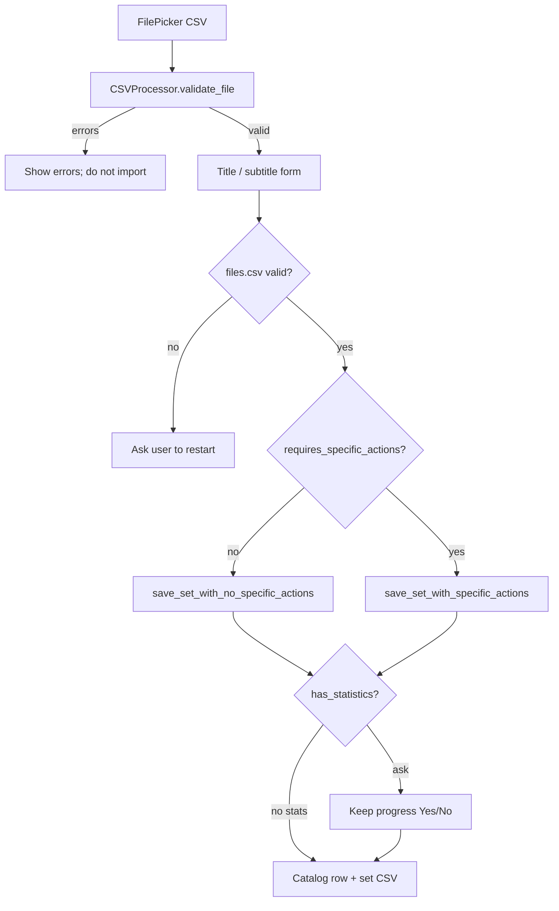

# Import and export

Import adds an external CSV as a new learning set. Export copies an existing
set out through the shared file picker. Validation and repair live in
`data/csv_processor.py`; the Import/Export screen in
`ui/screens/import_export_control.py` drives the dialogs.

Set schemas and storage paths are described in
[Data and storage](../architecture/data-and-storage.md). Message enums are in
the [Constants API](../reference/constants.md).

## Import flow



`ImportExportControl` picks a single `.csv` file with its **own**
`FilePicker` (`csv_file_selector` on the screen), calls `validate_file`, and
shows warnings or errors with `create_alert_dialog` from
`ui/page_functions.py` (title + message, optional second action button for
Yes/No flows such as keep-progress). On success it stores validation flags on
the control and lets the user confirm title and subtitle before save. There is
no separate API page for that helper — call it from screen code when you need
a blocking alert over Import/Export (or reuse the same pattern elsewhere).

Export is separate: tile actions use
`AppSession.get_export_csv_picker()` (see
[State and persistence](state-and-persistence.md)). That shared picker is a
runtime service for **export only**, not for choosing an import file and not a
place to hold CSV content.

## Validate a set file

```python
from learning_app.data.csv_processor import CSVProcessor

result = CSVProcessor.validate_file(file_path)
```

`validate_file` returns a dict:

| Key | Meaning |
| --- | --- |
| `is_valid` | `False` when import must stop |
| `errors` | Fatal messages (`Errors` enum values) |
| `warnings` | Non-fatal messages (`Warnings` enum values) |
| `requires_specific_actions` | `True` when save must use the repair path |
| `has_statistics` | `True` when all stats columns look usable |
| `data_type` | `"words"` or `"definitions"` when detected |
| `name_suggestion` | Suggested title stem from the file name |

### Errors versus warnings

- **Errors** block import (`is_valid` becomes `False`): not a CSV, load
  failure, missing required content columns, too many rows (`MAX_ROWS`),
  empty content that cannot form a set, and similar hard failures.
- **Warnings** allow import to continue but set
  `requires_specific_actions`: bad index column, unexpected extra columns,
  file-name suffix mismatch, broken or inconsistent statistics, sparse rows
  that should be dropped on save, and related issues.

When `is_valid` is `False`, the UI shows the error list and does not open the
title form. When valid with warnings, the UI still proceeds and surfaces the
warning text.

## Save after validation

Choose the save helper from the validation flags:

| Condition | Helper |
| --- | --- |
| Valid, no specific actions | `save_set_with_no_specific_actions` |
| Valid, specific actions required | `save_set_with_specific_actions` |

Both helpers:

1. Read the picked file.
2. Normalize or rebuild statistics columns according to `has_statistics` and
   `keep_statistics`.
3. Rebuild a contiguous index from zero.
4. Allocate a unique basename under `csv_files/`.
5. Call `add_new_file` and `save_set`.

```python
CSVProcessor.save_set_with_no_specific_actions(
    file_path,
    file_name,
    title,
    subtitle,
    has_statistics=True,
    keep_statistics=True,
)
```

```python
info = CSVProcessor.save_set_with_specific_actions(
    file_path,
    file_name,
    title,
    subtitle,
    data_type="words",
    has_statistics=True,
    warnings=result["warnings"],
    keep_statistics=False,
)
```

`save_set_with_specific_actions` may return an information string (for
example when statistics columns were discarded because of type errors). The
Import screen shows that text in a follow-up dialog.

### Keep progress dialog

When `has_statistics` is `True`, the UI asks whether to keep progress. That
maps to `keep_statistics=True` (Yes) or `False` / treating the file as
without usable stats (No). Do not invent a third persistence path in screen
code; pass the flag into the matching save helper.

## Catalog integrity: `files.csv`

Before adding a set, the Import screen checks the catalog:

```python
if not CSVProcessor.validate_files_csv()["is_valid"]:
    # UI asks the user to restart; navigation may stay locked
    ...
```

`validate_files_csv` checks existence, required columns, empty names/titles,
duplicate basenames, suffix rules, and whether listed files exist on disk.
Missing files are warnings; structural problems are errors.

`repair_files_csv` attempts cleanup (recreate empty catalog, drop bad rows,
fill empty subtitles, remove duplicates or missing-file entries). Prefer
calling it from maintenance or recovery flows after understanding the
validation result; the default Import path currently asks for an app restart
when the catalog is invalid rather than auto-repairing mid-import.

## Export

Export tiles reuse the shared export `TilesContainer` from
[Body registry](../concepts/body-registry.md). Choosing export on a tile opens
`AppSession.get_export_csv_picker().save_file(...)` and writes the existing
set CSV to the path the user picks. Export does not re-run
`validate_file`; the file already lives under application storage.

### Search on the Export tab

The Import/Export screen shows the bottom-bar search button only while the
**Export** tab is selected. Clicking it calls `go_search(..., mode="export")`,
which requires the export body to be registered (it is created when
`ImportExportControl` first builds). Do not call export search before visiting
Import/Export — see [Navigation guide](navigation.md#open-search) and
[Body registry](../concepts/body-registry.md).

## Ownership checklist

| Concern | Owner |
| --- | --- |
| Validate / repair / import save | `CSVProcessor` |
| Dialogs and form state | `ImportExportControl` (+ `create_alert_dialog`) |
| Import file picker | `ImportExportControl.csv_file_selector` |
| Shared export picker | `AppSession` |
| Disk paths and catalog helpers | `FilePathManager` / `app_data` helpers |

Do not keep imported DataFrames or catalog rows in `AppSession`.

## Continue reading

- [Data and storage](../architecture/data-and-storage.md)
- [Learning algorithm](../concepts/learning-algorithm.md)
- [State and persistence](state-and-persistence.md)
- [CSV processor API](../reference/csv_processor.md)
- [Constants API](../reference/constants.md)
- [App session API](../reference/app_session.md)
