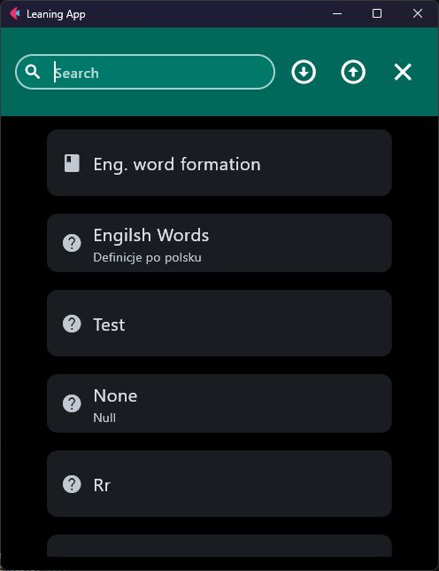

# Navigation

Application code should use helpers from `ui/navigation.py`
instead of manipulating `page.views` directly. Import route constants from
`ui/route_paths.py`.

Choose the helper from the navigation intent:

- Main Shell destination → `navigate_to()` or `navigate_to_async()`.
- Focused Deep task → `push_view()`.
- Close the active Deep task, or in-place search when open → `go_back()`.
- Search the active tile source (in-place, not a route) → `go_search()`.

See [Two navigation roles](../architecture/routing-and-screens.md#two-navigation-roles) if the
Shell/Deep distinction is not yet clear.

## Open a Shell screen

Use `navigate_to(page, route, **params)` from synchronous code:

```python
from learning_app.ui.navigation import navigate_to
from learning_app.ui.route_paths import HOME_ROUTE

navigate_to(page, HOME_ROUTE)
```

`navigate_to()` replaces the current view stack with the requested Shell
destination. Use it when changing the application's main screen, rather than
when opening a temporary task above the current screen.

Use `navigate_to_async()` inside async handlers. The drawer uses this form
because its open and close operations are asynchronous.

```python
await navigate_to_async(page, HOME_ROUTE)
```

## Open and close a Deep screen

`push_view()` keeps the current view available beneath the focused screen:

```python
from learning_app.ui.navigation import push_view
from learning_app.ui.route_paths import SET_EDIT_ROUTE

push_view(
    page,
    SET_EDIT_ROUTE,
    file="animals_words.csv",
    title="Animals",
)
```

Open the learn menu or an active learn session the same way:

```python
from learning_app.ui.route_paths import (
    SET_LEARN_ROUTE,
    SET_LEARN_SESSION_ROUTE,
)

push_view(page, SET_LEARN_ROUTE, file="animals_words.csv")
push_view(page, SET_LEARN_SESSION_ROUTE, file="animals_words.csv")
```

`SET_LEARN_ROUTE` is the set menu; `SET_LEARN_SESSION_ROUTE` is the active
practice view. Both require `file` (the set basename).

`push_view()` is the normal entry point for a registered Deep route. If it
receives a Shell route, the router does not push that route onto the stack; it
falls back to the same stack-replacement behavior as `navigate_to()`. Call
`navigate_to()` directly for Shell navigation so the intent remains clear.

The parameters become a query string:

```text
/set/edit?file=animals_words.csv&title=Animals
```

`build_route()` converts every non-`None` value to text and URL-encodes it.
The router decodes the query into `dict[str, str]`, so factories receive route
parameters as strings even when the caller supplied another value type.

The build factory reads the parsed values:

```python
def _build_edit_set_controls(
    page: ft.Page,
    params: dict[str, str],
) -> list[ft.Control] | None:
    file_name = params.get("file")
    title = params.get("title")
```

If required data is absent, a set CSV referenced by ``file`` no longer
exists on disk, or a create-set edit URL still carries ``title`` after that
CSV was already created, the factory can return `None`. The router then builds
the route configured in `RouteDef.fallback_path` (usually Home), pushes that
fallback URL so browser history stays consistent, and may show a short
SnackBar (`This set no longer exists.` or `This set already exists.`). This
prevents crashes from stale deep links after delete, blocks re-creating a
duplicate catalog entry from browser Back, and avoids showing an incomplete
Deep screen with missing input.

```python
def _build_edit_set_controls(
    page: ft.Page,
    params: dict[str, str],
) -> list[ft.Control] | None:
    file_name = params.get("file")
    if not file_name:
        return None
    return [EditSetMenu(file_name)]


RouteDef(
    # ...
    build_factory=_build_edit_set_controls,
    fallback_path=HOME_ROUTE,
)
```

Close a Deep screen with `go_back()`:

```python
ft.Button(content="Cancel", on_click=lambda e: go_back(e.page))
```

## Open search

`go_search(page, mode="home")` opens in-place search for the active tile
source. Supported modes are `"home"` and `"export"`:

```python
go_search(page, mode="export")
```

{ .docs-screenshot-sm }

Search obtains that source through the
[body registry](../concepts/body-registry.md), then inserts `SearchControl`
above the tiles without changing the route. Important constraints:

- Call `go_search(..., mode="export")` only after the Import/Export screen has
  registered the export `TilesContainer`. `BodyRegistry.get_export()` asserts
  if that body was never created.
- If the selected body has no content tiles, `go_search()` returns without
  opening search.
- On the Import/Export route, the bottom-bar search button is shown only on the
  **Export** tab; the screen toggles visibility itself. Startup still routes
  that button to `mode="export"` whenever the current path is Import/Export.
- `go_back()` closes in-place search first when it is open; otherwise it pops
  the active route view. System back (`handle_view_pop`) does the same while
  search is active, so the shell route is not popped.

See the [Navigation API](../reference/navigation.md) and
[Route URL API](../reference/route_url.md) for complete signatures and
parameter encoding contracts. `RouteDef` and `fallback_path` are documented
in the [Route registry API](../reference/route_registry.md).
