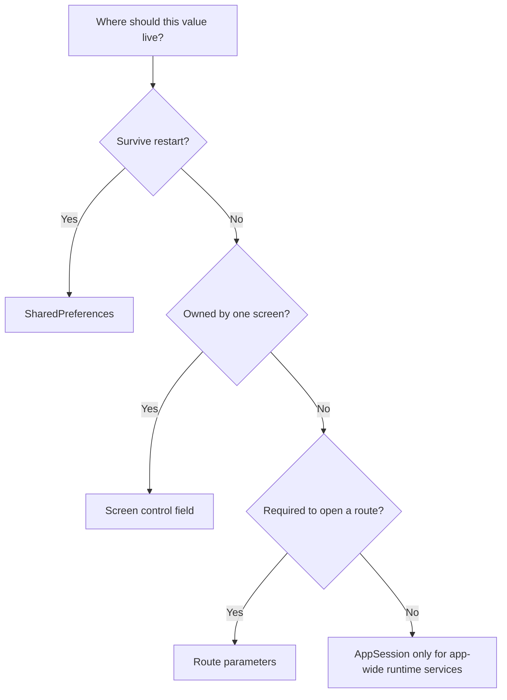

# State and persistence

Choose storage from the value's lifetime, owner, and purpose. Do not move a
value into a global registry merely because more than one function needs it.



`BodyRegistry` is a separate, narrowly scoped exception for sharing Home and
Import/Export tile bodies with Search. It is not a general state store.

## Local screen state

Keep transient UI state on the control that owns it:

```python
class MyForm(ft.Column):
    def __init__(self):
        super().__init__()
        self.selected_kind: str | None = None
        self.title_field = ft.TextField(label="Title")
```

This is appropriate for form values, selection, validation messages, and other
data that should disappear with the screen.

## Route parameters

Use route parameters for values required to construct a particular screen:

```python
push_view(
    page,
    SET_EDIT_ROUTE,
    file="animals_words.csv",
    title="Animals",
)
```

The build factory receives them as strings:

```python
def _build_edit_set_controls(
    page: ft.Page,
    params: dict[str, str],
) -> list[ft.Control] | None:
    file_name = params.get("file")
    if not file_name:
        return None
    return [EditSetMenu(file_name)]
```

Route parameters make navigation reproducible and allow the factory to reject
an incomplete route through its configured fallback.

## Application runtime services

`AppSession` owns process-wide UI objects and interaction state that should
exist once while the application is running.

### Shared page and file picker

```python
AppSession.set_page(page)

page = AppSession.get_page()
export_picker = AppSession.get_export_csv_picker()
```

The export picker is created lazily and reused rather than constructing a new
service for each export action.

### Temporary navigation lock

```python
AppSession.disable_all_navigation_controls()
try:
    await perform_protected_operation()
finally:
    AppSession.enable_all_navigation_controls()
```

This coordinates the drawer, bottom-bar buttons, and FAB while an operation
must not be interrupted.

Do not put these values in `AppSession`:

- fields belonging to one form,
- learning-set or other domain data,
- values that should survive restart,
- arbitrary controls that are not application-wide services.

## Persisted preferences

Use Flet `SharedPreferences` for small settings that should survive an
application restart:

```python
from learning_app.ui.preferences import get_shared_preferences

storage = get_shared_preferences()
await storage.set("theme_mode", ft.ThemeMode.DARK.value)
theme_mode = await storage.get("theme_mode")
```

Theme mode and theme slider values are current examples. Keep large domain
data and temporary controls out of this store.

## Where `BodyRegistry` fits

`BodyRegistry` stores only the active Home and Import/Export
`TilesContainer` instances so Search can filter the same controls the user was
already viewing. It should not hold preferences, route parameters, form state,
or general domain data. See [Body registry](../concepts/body-registry.md).

For generated contracts, see the
[App session API](../reference/app_session.md),
[Preferences API](../reference/preferences.md), and
[Body registry API](../reference/body_registry.md).
