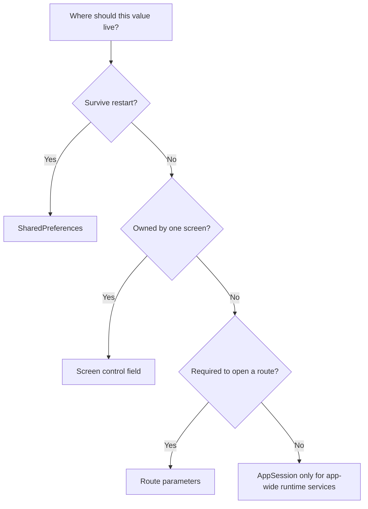

# State and persistence

Choose storage from the value's lifetime, owner, and purpose. Do not move a
value into a global registry merely because more than one function needs it.



`BodyRegistry` in `ui/body_registry.py` is a separate, narrowly
scoped exception for sharing Home and Import/Export tile bodies with
in-place search. It is not a general state store.

Learning-set content and progress do **not** belong in `AppSession`,
preferences, or `BodyRegistry`. They live as CSV files under application
storage and are accessed through `data/` helpers (and `AppData` during a learn
session). See [Data and storage](../architecture/data-and-storage.md).

## Local screen state

Keep transient UI state on the control that owns it:

```python
class MyForm(ft.Column):
    def __init__(self):
        super().__init__()
        self.selected_kind: str | None = None
        self.title_field = ft.TextField(label="Title")
```

This is appropriate for form values, selection, validation messages, and other
data that should disappear with the screen.

## Route parameters

Use route parameters for values required to construct a particular screen:

```python
push_view(
    page,
    SET_EDIT_ROUTE,
    file="animals_words.csv",
    title="Animals",
)
```

The build factory receives them as strings:

```python
def _build_edit_set_controls(
    page: ft.Page,
    params: dict[str, str],
) -> list[ft.Control] | None:
    file_name = params.get("file")
    if not file_name:
        return None
    return [EditSetMenu(file_name)]
```

Route parameters make navigation reproducible and allow the factory to reject
an incomplete route through its configured fallback.

## Application runtime services

`AppSession` in `ui/app_session.py` owns process-wide UI objects
and interaction state that should exist once while the application is running.

### Shared page and file picker

```python
AppSession.set_page(page)

page = AppSession.get_page()
export_picker = AppSession.get_export_csv_picker()
tts_service = AppSession.get_tts_service()
await AppSession.speak("insult", "en")
```

The export picker is created lazily and reused rather than constructing a new
service for each export action. It holds the picker control only — not CSV
bytes or catalog rows. Import uses a separate `FilePicker` on
`ImportExportControl`. Validation and save helpers stay on `CSVProcessor`;
see [Import and export](import-export.md).

The export picker is created lazily and reused rather than constructing a new
service for each export action. It holds the picker control only — not CSV
bytes or catalog rows. Import uses a separate `FilePicker` on
`ImportExportControl`. Validation and save helpers stay on `CSVProcessor`;
see [Import and export](import-export.md).

TTS uses one `TtsService` for the whole session. The `Audio` player is
created on first `speak` (never with an empty `src`) and reused. A newer
`speak` takes over the slash-separated playlist; the current clip is not
paused or stopped. Repeating the same cached file skips remounting and the
load wait so the speaker button can replay immediately. Do not add `Audio`
controls to tiles or learn screens.

### Temporary navigation lock

```python
AppSession.disable_all_navigation_controls()
try:
    await perform_protected_operation()
finally:
    AppSession.enable_all_navigation_controls()
```

This coordinates the drawer, bottom-bar buttons, FAB, and home/export sort
dropdowns while an operation must not be interrupted.

Do not put these values in `AppSession`:

- fields belonging to one form,
- learning-set or other domain data,
- imported DataFrames or catalog rows,
- values that should survive restart,
- arbitrary controls that are not application-wide services.

## Persisted preferences

Use Flet `SharedPreferences` via `ui/preferences.py` for small
settings that should survive an application restart:

```python
from learning_app.ui.preferences import get_shared_preferences

storage = get_shared_preferences()
await storage.set("theme_mode", ft.ThemeMode.DARK.value)
theme_mode = await storage.get("theme_mode")
```

Theme mode, background-shade, TTS, and learn-retry keys are the preference
consumers today; see [Theming](#theming), [Text to speech](#text-to-speech),
and [Learning](#learning) below.
Keep large domain data and temporary controls out of this store.

## Theming

Theme **mode** and **content background** are preference-backed and owned at
runtime by `AppTheme` in `ui/app_theme.py`. The Settings screen
(`SettingsControl` / `BackgroundShadeSlider` in
`ui/screens/settings_control.py`) is the UI that edits them. The same screen
also hosts **Text to speech** (language, auto-speak, and word-list speakers; see
[Text to speech](#text-to-speech)), **Learning** (retry until correct; see
[Learning](#learning)), and **Demo sets** (install bundled samples
via `install_demo_sets()`; that path writes CSVs and `files.csv`, not
preferences — see
[Demo sets](../architecture/data-and-storage.md#demo-sets)). Startup
restores theme before the first route so Home does not flash the wrong look;
see [Startup](../architecture/startup.md).

### Preference keys

| Key | Role |
| --- | --- |
| `theme_mode` | `"dark"` or `"light"` (`ThemeMode` value) |
| `dark_theme_slider_value` / `light_theme_slider_value` | Shade index `1`–`4` as a string |
| `dark_theme_bgcolor` / `light_theme_bgcolor` | Resolved page/view background color |

Missing keys are seeded once in `app.py` (default dark mode, slider `2`,
`SURFACE` bgcolor).

### Runtime flow

1. Startup sets `page.theme_mode`, applies the matching bgcolor, then
   `AppTheme.load_from_preferences()` and `AppTheme.sync_from_page(page)`.
2. Settings toggles light/dark: writes `theme_mode`, syncs `AppTheme`, and
   reapplies the bgcolor for that mode (including the saved slider shade).
3. The shade slider updates `AppTheme` slider/color for the **active** mode,
   calls `AppTheme.apply_to_page`, and persists
   `{mode}_theme_slider_value` / `{mode}_theme_bgcolor`.
4. The router and layout hosts call `AppTheme.apply_to_page` /
   `current_bgcolor()` when building or resizing views so stacked views stay
   consistent.

`set_theme_from_bgcolor` in `ui/page_functions.py` is a thin wrapper around
`AppTheme.apply_bgcolor` used during startup.

### Content background vs Shell chrome

| Layer | Where it lives | User-editable? |
| --- | --- | --- |
| Page / view bgcolor | Preferences + `AppTheme` | Yes — Settings shade slider |
| AppBar, bottom bar, FAB, icon/title colors | Hardcoded `colors` map in `app.py` | No — change the map in code |

Do not put Shell teal (or other chrome colors) into preferences unless you
intentionally design a second prefs surface for them.

### Related

- Screen: `/settings` in
  [Routing and screens](../architecture/routing-and-screens.md)
- Demo install: [Demo sets](../architecture/data-and-storage.md#demo-sets),
  [Demo sets API](../reference/demo_sets.md)
- APIs: [App theme](../reference/app_theme.md),
  [Preferences](../reference/preferences.md)

## Text to speech

TTS **language**, **auto-speak on definitions Check**, and **word-list
speakers** are preference-backed and owned at runtime by `TtsPreferences` in
`ui/tts_preferences.py`. Settings is the UI that edits them. Under Text to
speech, **Word list speakers** separates word-formation switches from
definition-card switches, warns that definition text may not match the global
TTS language, and shows always-visible sample cards under Word formations and
Definitions.
Definitions learn (`WordDefinitionField`) calls `AppSession.speak` with that
language; auto-speak does not show error snackbars (the speaker button still
does). Word-list cards (`WordContainer`) show per-field speakers when the
matching switch is on.

Cached MP3s live under `tts_cache/` and are pruned when set content is deleted
or rewritten — see [Data and storage](../architecture/data-and-storage.md#tts-cache).

### Preference keys

| Key | Role |
| --- | --- |
| `tts_language` | gTTS language code (`en`, `pl`, `zh-CN`, …) |
| `tts_auto_speak_definitions` | `"true"` or `"false"`; pronounce the word after Check |
| `tts_speakers_word_formations` | `"true"` or `"false"`; speakers on word-formation list fields |
| `tts_speakers_word` | `"true"` or `"false"`; speakers on definition-list word fields |
| `tts_speakers_definition` | `"true"` or `"false"`; speakers on definition-list definition fields |

Missing keys are seeded in `TtsPreferences.load_from_preferences()` (English,
auto-speak on, word-formation and word speakers on, definition speakers off).

### Related

- Screen: `/settings` in
  [Routing and screens](../architecture/routing-and-screens.md)
- Playback: [App session](../reference/app_session.md)
- APIs: [TTS preferences](../reference/tts_preferences.md),
  [TTS](../reference/tts.md)

## Learning {#learning}

The **retype until correct** switch is preference-backed and owned at runtime
by `LearnPreferences` in `ui/learn_preferences.py`. Settings is the UI that
edits it. `BaseWordField` reads the flag during Check: a wrong first answer
still writes statistics once, then extra attempts stay on the same card and
do not call `good_answer_at_current_row` / `bad_answer_at_current_row`. Queue
rules remain on `AppData` — see
[Learning algorithm](../concepts/learning-algorithm.md#retry-until-correct).

### Preference keys

| Key | Role |
| --- | --- |
| `learn_retry_until_correct` | `"true"` or `"false"`; stay on a card until Check is correct |

Missing keys are seeded in `LearnPreferences.load_from_preferences()` (on).

### Related

- Screen: `/settings` in
  [Routing and screens](../architecture/routing-and-screens.md)
- Session UI: [UI components](../concepts/ui-components.md)
- API: [Learn preferences](../reference/learn_preferences.md)

## Where `BodyRegistry` fits

`BodyRegistry` in `ui/body_registry.py` stores only the active
Home and Import/Export `TilesContainer` instances so in-place search can
filter the same controls the user was already viewing. It should not hold
preferences, route parameters, form state, or general domain data. See
[Body registry](../concepts/body-registry.md).

## Where set data fits

Catalog rows, set CSVs, and learning statistics belong on disk via
`data/file_path_manager.py` and `data/app_data.py`. Resetting progress uses
`set_default_progress`; deleting a set uses `delate_set`. During a learn
session, queue and answer transitions live on `AppData` — not in
`AppSession`. The retry-until-correct switch lives in `LearnPreferences`.
See [Data and storage](../architecture/data-and-storage.md) and
[Learning algorithm](../concepts/learning-algorithm.md).

For generated contracts, see the
[App session API](../reference/app_session.md),
[Preferences API](../reference/preferences.md),
[App theme API](../reference/app_theme.md),
[TTS preferences API](../reference/tts_preferences.md),
[TTS API](../reference/tts.md),
[Learn preferences API](../reference/learn_preferences.md),
[Body registry API](../reference/body_registry.md),
[File path manager API](../reference/file_path_manager.md),
[App data API](../reference/app_data.md),
[Constants API](../reference/constants.md), and
[CSV processor API](../reference/csv_processor.md).
